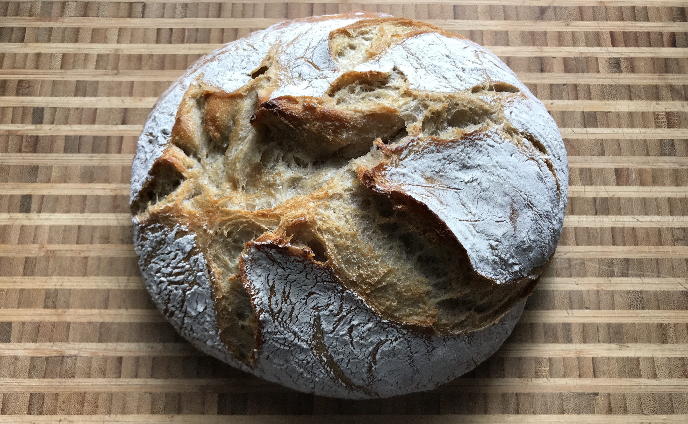
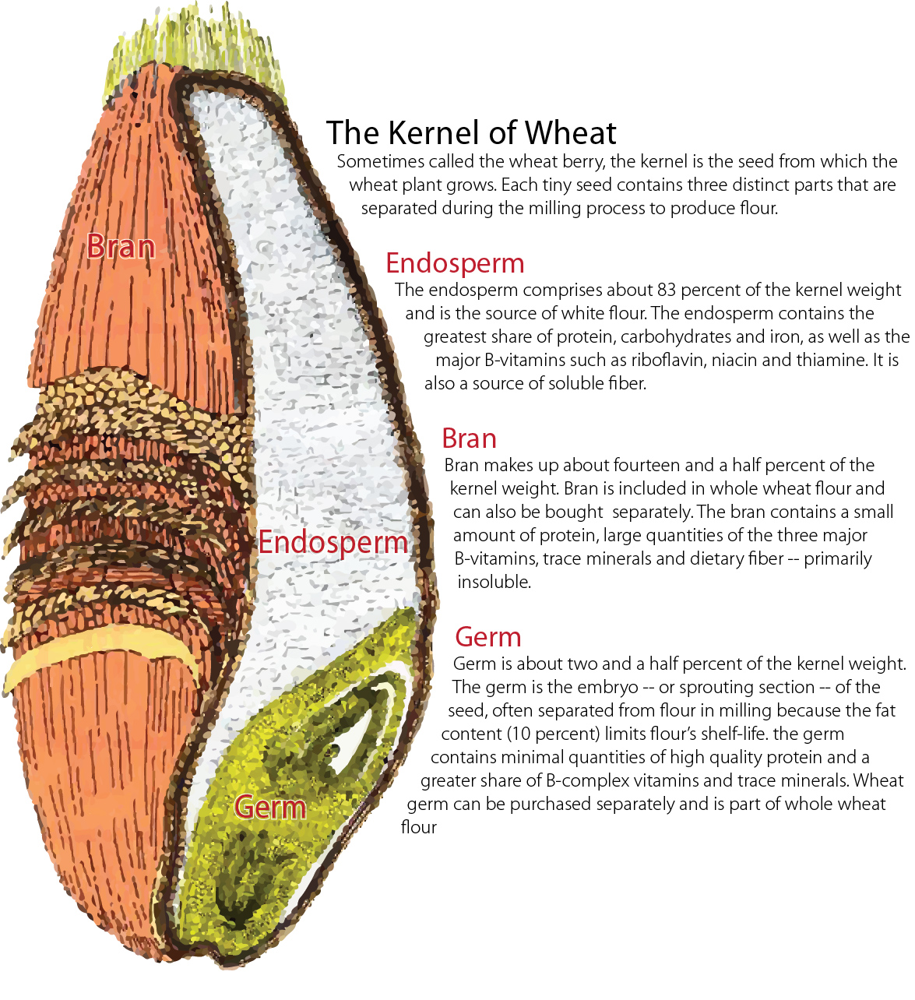
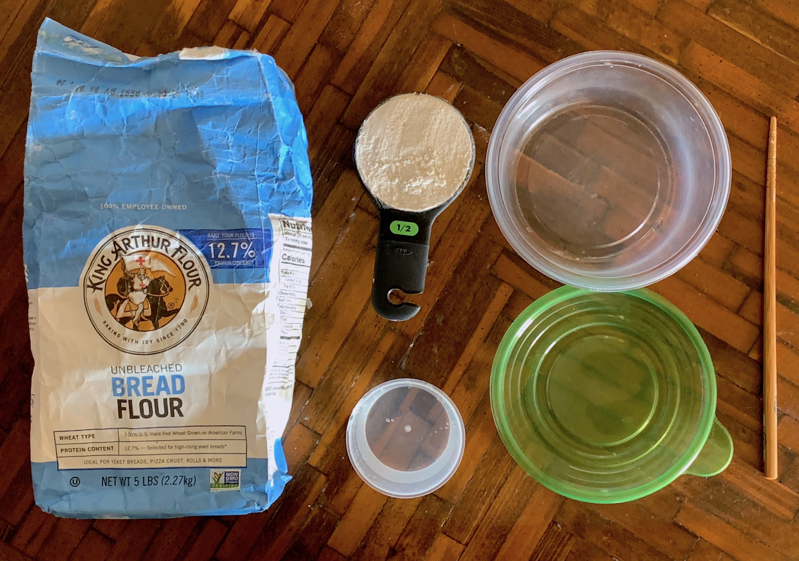
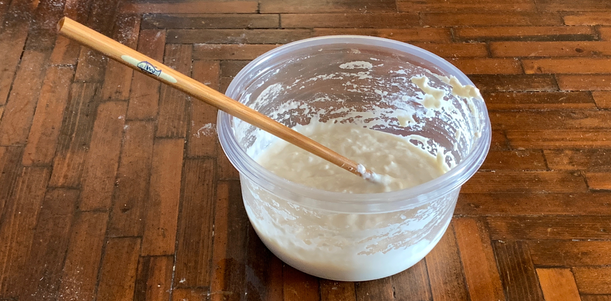
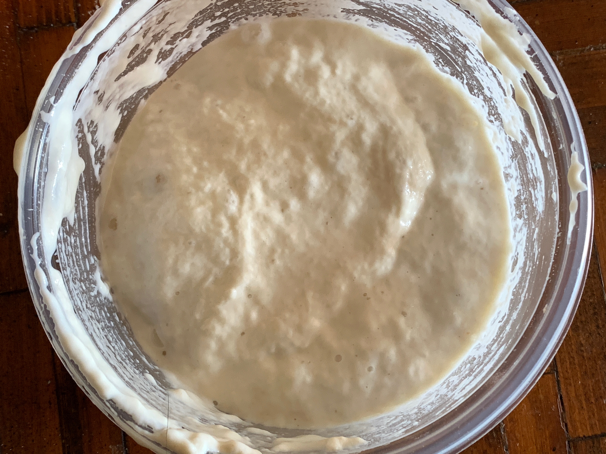
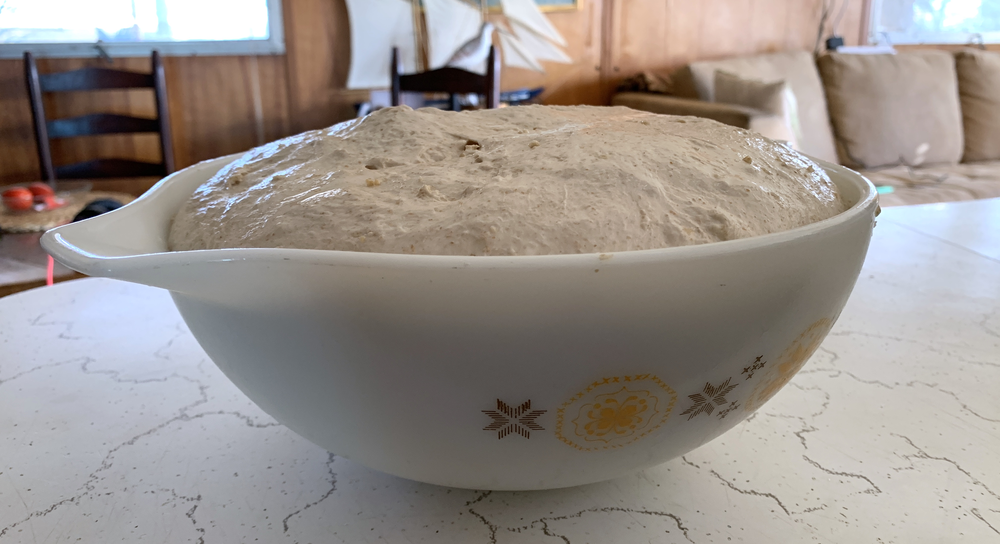
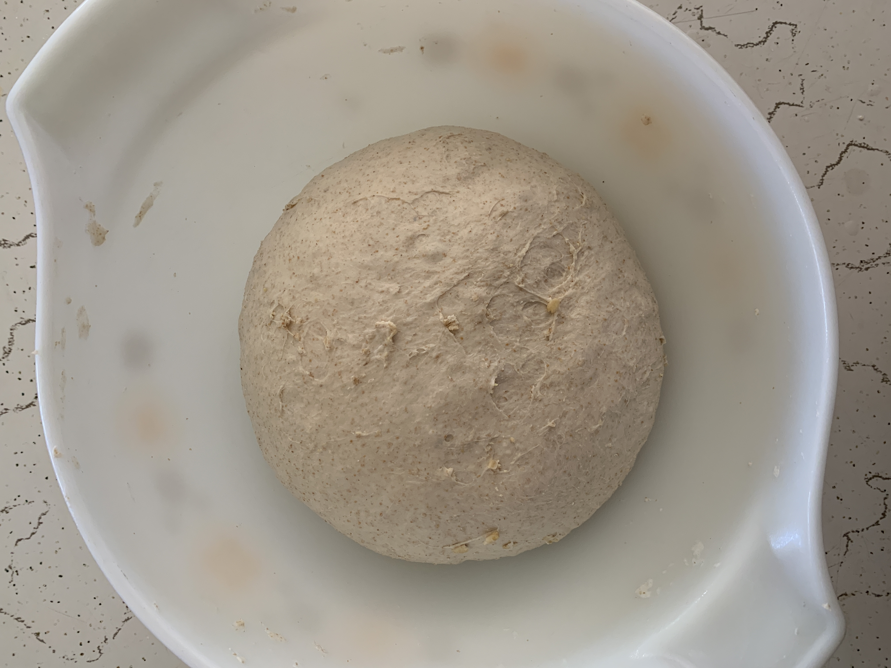
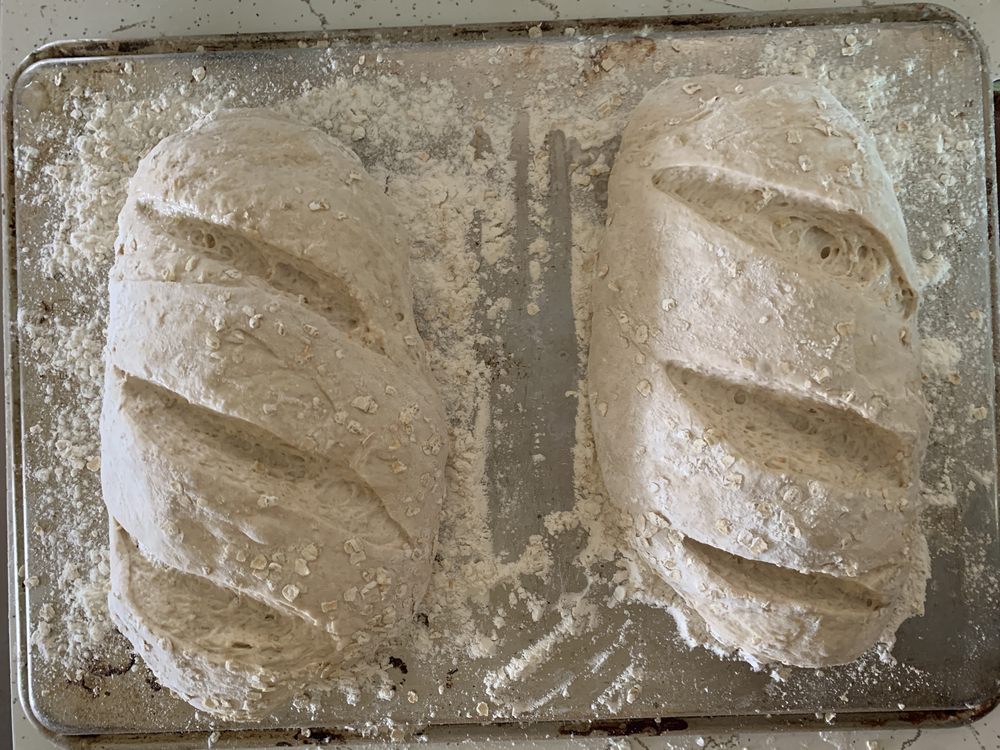
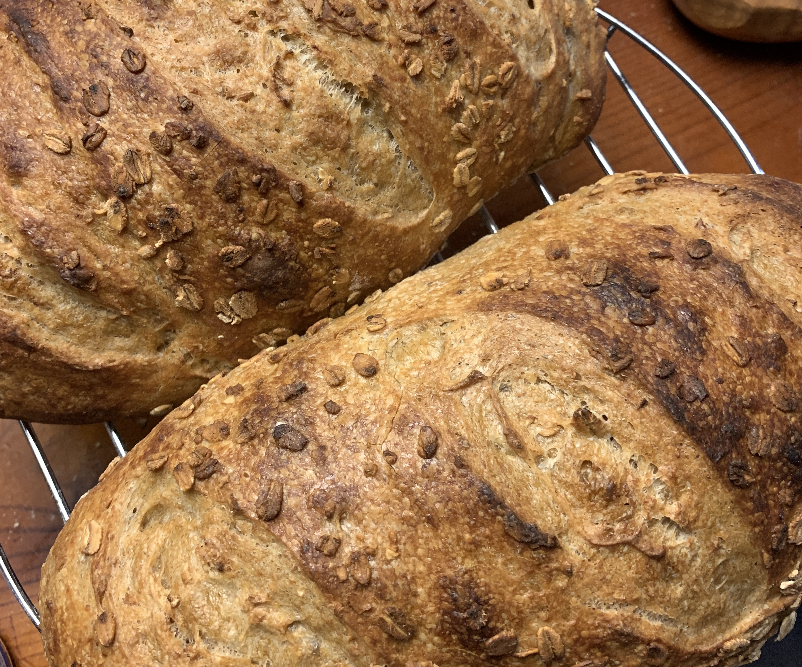

# Rustic Bread - The Phil Stearns Method

## Introduction

I started baking after some friends and I decided to take up the challenge of making grilled pizza. Our first attempts were so delicious that it quickly became a staple at summer grill outs. At the time we were using pre-made dough from the infamous Park Slope Food Coop and local pizza joints who would sell us the raw dough.

How hard could it be to make Pizza dough from scratch? That was what lead me down a 7 year path to making bread at Brahman.

I've put together this little resource as a way of passing along the techniques and a little knowledge I've built up during that time.

## Outline

The history of bread making goes back eons, some 14,600 to 11,600 years ago, as evidenced by charred crumbs of a flatbread made by Natufian hunter-gatherers found at an archaeological site in the Black Desert in Jordan.[[source](https://en.wikipedia.org/wiki/History_of_bread#Antiquity)]. While the development of bread making through history is fascinating and provides a wonderful window into the histories of different cultures around the world, we're going to keep things practical and focused on my own process.

* Tools
* Ingredients
* Pre-ferment
* Measurement
* Mix
* Bulk Fermentation
* Kneading
* Cold Fermentation
* Shaping
* Final Proof
* Score
* Baking
* Cooling and Storing

### Additional Resources:

* [Bakerpedia](https://bakerpedia.com/)
* [Breadtopia](https://breadtopia.com/)

## Tools

I've been at a disadvantage here in Bombay Beach due to a lack of several key tools:

* Digital Infrared Thermometer (point and shoot)
* Meat Thermometer
* Dutch Oven
* Digital Scale

Tools I've been working with:

* Measuring cups and spoons
* Mixing bowls
* Baking trays
* Plastic bags
* Chopsticks
* Spatulas
* Mixing Spoons

## Ingredients: Flour, Water, Salt, Temperature, Time

Yes, it's a simple as that.

### Flour

Unbleached, Always

**Wheat**

[[source](https://flour.com/anatomy-of-a-wheat-kernel/)]

* All purpose
	* oftentimes contains malted barley
	* good enough to make bread but not ideal
* White
	* usually a single variety of wheat
	* refined to remove bran and endosperm
	* generally slightly higher protein content than All purpose
* Bread
	* contains more protein
	* referred to as "strong" flour
	* sometimes a slightly finer grind
* Whole
	* contains wheat bran and germ
	* contains more protein than bread flour
	* rich flavor but can create dense breads

**Rye**

A grain closely related to barley and wheat. Tends to have a stickier consistency, imparts a nice spicy and nutty aroma and flavor to a loaf. I generally never use more than 1/4 the total flour volume.

* [An excellent guide to the classifications from Dark to Light](http://theryebaker.com/rye-flour/)

**Other Grains**

* Spelt
* Kamut
* Faro
* Semolina

### Water

* Distilled or Filtered preferred
* Tap water is OK

### Gluten

Protein in grains:

> Gluten forms when glutenin molecules cross-link via disulfide bonds to form a submicroscopic network attached to gliadin, which contributes viscosity (thickness) and extensibility to the mix.[2][12] If this dough is leavened with yeast, fermentation produces carbon dioxide bubbles, which, trapped by the gluten network, cause the dough to rise.

By hydrating the flour, we're allowing the proteins to unfold and link together.

### Salt

* Interferes with gluten formation
* Impedes the growth of starter culture

#### Types

* Sea Salt (coarse/fine)
* Kosher Salt (generally coarse)
* Iodized Salt (fine crystals)
* Naturally Evaporated Sea Salts (e.g. Maldon Salt or other finishing salts)

Can impact the flavor and other aspects. I generally try to use fine sea salt.

## Pre-Fermentation: The Starter

Commercial yeast will make decent bread and is preferred for certain specialty breads. For artisanal or rustic breads, oftentimes a starter is used. Commonly referred to as a sourdough starter, this is a pre-fermented ingredient created by culturing naturally occurring yeast and lacto-bacteria in a medium of water and flour.

The cultures are converting starches into alcohols, sugars and CO2 gas. Alcohols breakdown into vinegars and a rich sour smell and flavor eventually develops.

### Ingredients

* 1/2 C Unbleached flour
* 1/2 C Water (distilled or filtered water ideal)

### Directions

 
Mixed starter.

1. Mix flour and water thoroughly in a pint size jar (or larger if you plan on working up to a bigger batch)
	* note: the consistency should be like thick pancake batter 
1. Cover with a lid but leave loose enough for gas to escape
1. Check up on it in 8 hours
1. If bubbling, that means the microbes are active and fermentation is beginning!
1. Discard half of the mixture and repeat

After 7 days of this, you can make bread!

 
Cassandra is ~7 years old, ready to make bread!

### Feeding

If the cultures eat up all the flour, they starve. You must continuously feed the starter cultures periodically to keep them alive. 

* Discard the top layer, up to half of the culture. Pour off fluids if necessary.
* Mix in equal parts flour and water (sometime less water to maintain thick batter like consistency)

#### Tempurature

* At room temp, the starter needs to be fed every 12 hours
* Once you've gotten the starter to the point where you can make bread, you can refrigerate after feeding for up to a week, at which point it needs to be fed again.

## Measurements

Typically I use a rough version of bakers percentage to determine the amount of water to add to a given amount of flour. This gets confusing when dealing with volume vs weight. At Bombay Beach, I have been feeling out volume based measurements and have a few general rules:

* I generally try to use 1c Starter for every 4c dry flour
* I'll use roughly 1 Tbsp for every 4c dry flour

For the loaves I've been making here:

* 2c Flour (not more than 1/4 of which is spelt or whole wheat)
* 1/2c starter
* 1 1/2 tsp salt
* 1c + 2 Tbsp water

If I desire a hydration level of 75% (meaning the mass of water is 75% that of all other dry goods) then my math might look something like this:

**Starter Amount**

200g (100% hydration, 50/50 water flour)

**Dry Weight**

* 600g Flour
* 10g Salt
* 100g Flour (from starter)

Total Dry Weight: 710g

**Wet Weight**

* 710g * 75% Hydration = 533g
* 533g - 100g (from starter) = 433g

Total Wet Weight to Add: 433g

**Final Weights**

* Dry Flour: 600g
* Salt: 10g
* Water: 433g
* Starter: 200g

## Mix

* Combine Dry Ingredients and incorporate with a whisk or fork
* Add starter
* Add water
* Gently stir starter into water and work deeper into dry ingredients
* Scrape from sides
* Form a shaggy mass
* Add water or flour as necessary

## Autolyse

* Let the dough sit covered for 15-25 minutes

This is the process of mixing the flour and water and waiting a period of time before kneading. After mixing, the flour begins to hydrate and enzymes present within the flour begin the break down the proteins and convert starches to sugar.

There is a proper way to approach this, explored by Barb Alpern and published on the blog of the King Arthur Flour Company [[link](https://www.kingarthurflour.com/blog/2017/09/29/using-the-autolyse-method)]. Technically this process involves mixing only the water and flour together, letting it rest for 20 minutes to 60 minutes and THEN adding the starter and salt.

Personally, I tried this and was always frustrated by the extra effort required to properly incorporate the remaining ingredients to the hydrated flour. My approach is a lazy one. I just add everything together and give it a rest before proceeding.

## Kneading

* In the bowl, with wet hands, gently scoop and fold, turning the bowl 1/4 rotation each time.
* Press out lumps as you go.
* Form a dough that feels consistent
* Cover and let stand

## Bulk Fermentation

* Check on your dough in 2 hours for signs of life
* Check again every 2 hours
* You're looking for not only doubling, but bubbling
* At which point you can repeat the scoop and fold again

## Cold Fermentation

* Cover and let stand in a fridge from 12-24 hours
* This gives time for the fermentation process to develop the bread's flavor
* Also allows you to control the time (extend the process) by controlling temp

### Knead and Warm-Up

 
Dough fresh out of the fridge after ~16hrs of chillin'.

* Remove the dough from the fridge 2-3 hours prior to baking in order to bring the mass up to room temp.
	* Larger amounts will require more time.
	* It's OK if the dough doesn't get up to room temp.
* Gently scoop and fold the dough a few times
	* It will loose volume, but that's OK
	* Volume will be regained during warm-up

 
Dough after scooping and folding 4-6 times.

## Shape and Final Proof

 
Pre-shaping dough on a floured surface.

* turn the dough out onto a floured surface
	* flouring is done by sprinkling (DO NOT SPREAD BY HAND)
* To create a long loaf, stretch and roll up, keeping the seam on the bottom
	* Transfer long loaves onto a floured baking sheet immediately after shaping and gently cover 
* To create a round loaf, gather/fold the sides together and flip so that the folds are on the bottom
	* Transfer round loaves to a floured bowl (keep folds down) after shaping and gently cover

 
Dough split and shaped into two long loaves.
 
	 
## Score and Bake

 
Scored loaves ready for the oven.

1. move your racks so that both are as low as they can go.
1. place one baking tray on the lower rack and fill with ~1/4" of water
1. if baking a round loaf and you have a dutch oven, place both the lid and the oven side by side to pre-heat
1. pre-heat the oven to 450 degrees Fahrenheit
1. once the oven reaches temperature, score the bread
	* for long loaves, you can score lengthwise once or score diagonally multiple times using a wet chef's knife or straight razor
	* for round loaves on a tray, you can score in an x or a square
	* for round loaves in a dutch oven, remove from oven, flour, then turn the dough out into the dutch oven, cover.
1. place on the top rack in the center
1. spray with a water filled mister and then again 10 minutes into the bake
1. total bake time ~25-30min

* note: for round loaves in a dutch oven, bake 20 mins covered and then remove the cover, continue baking 20 additional minutes or until the crust is as dark as you like.
* note: the core temp of the loaf should reach a minimum of 200 degrees

## Cooling and Storing

 
Cooling loaves on a rack.

* Cool on a rack or devise someway to prevent moisture from making the bottom of the loaf moist
* Cool completely. It's still cooking for at least 15 minutes after you remove from the oven
* After about 2 hours, ideally 3, the loafs are ready to sample.
* You can slice and freeze loaves. Toast on demand.
* NEVER Refrigerate your bread!

