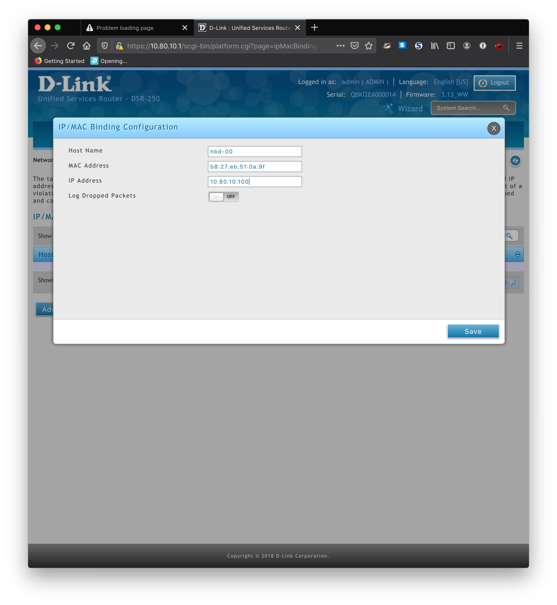

# Cluster configuration

Rough Outline of the Process:

1. Flash the RPi and enable ssh
2. Power up the RPi and connect over ethernet
3. Obtain MAC address using `ssh pi@raspberrypi.local 'ip address show eth0'`
	* For multiple devices, you'll have to remove the signature from `~/.ssh/known_hosts`. On OSX, the command is: `sed -i '' -e '$ d' ~/.ssh/known_hosts`
	* One-liner after first device: `ssh pi@raspberrypi.local 'ip address show eth0';sed -i '' -e '$ d' ~/.ssh/known_hosts`
4. Configure Router to reserve IP addresses for cluster devices
5. Setup Ansible Inventory
6. Configure SSH hosts
	*  Run `for i in {000..015}; do IP_ADDR=10.79.20.1$(printf "%02d" $i);ssh-keyscan $IP_ADDR >> ~/.ssh/known_hosts;done`
	*  re above: you may have to remove old signatures if IPs have been seen before and signatures are different.
	* `export ANSIBLE_HOST_KEY_CHECKING=False`
	* Edit `/etc/hosts`
	* Edit `~/.ssh/config`

## Available Devices

A full list of available Single Board Computers (SBCs) is available here: [devices.md](devices.md).

See bellow for a list of devices currently connected to the cluster:

```
HOSTNAME		IP ADDRESS			DEVICE TYPE
--------		----------			-----------
cluster000		10.79.20.100		RPi 3 B+
cluster001		10.79.20.101		RPi 3 B+
cluster002		10.79.20.102		RPi 3 B+
cluster003		10.79.20.103		RPi 3 B+
cluster004		10.79.20.104		RPi 3 B+
cluster005		10.79.20.105		RPi 3 B+
cluster006		10.79.20.106		RPi 3 B+
cluster007		10.79.20.107		RPi 3 B+
cluster008		10.79.20.108		RPi 3 B+
cluster009		10.79.20.109		RPi 3 B+
cluster010		10.79.20.110		RPi 3 B+
cluster011		10.79.20.111		RPi 3 B+
cluster012		10.79.20.112		RPi 2 B
cluster013		10.79.20.113		RPi B+
cluster014		10.79.20.114		RPi
cluster015		10.79.20.115		RPi
cluster_storage	10.79.20.99 		Beaglebone Black Rev. C
ubt_controller	10.79.20.254		Beaglebone Black Rev. C

```

## Router Setup

* Using a Dlink DIR-250 Unified Service Router to connect to the BRAHMAN-AI LAN @ 10.79.10.30 via the dedicated WAN connection
* It's internal IP space is 10.79.20.0/24
* DHCP is enabled and using 10.79.20.2-254
* To allow for access to the cluster from the BRAHMAN-AI LAN, the DSR-250 was configured to:
	* Classical Routing - Allows internal IP range to be accessible via dedicated WAN
	* Added a firewall rule to allow packets from 10.79.10.0/24 to 10.79.20.0/24
	* Configured a static route on the EXR from 10.79.10.0/24 to 10.79.10.30 (named cluster)
* DHCP Reservation and IP/MAC binding (optional) used to set RPis on predictable IP addresses
* All the RPis have been preconfigured with unique hostnames, so this is a bit different than starting from scratch.
* Use a `bash` one-liner to grab hostnames and MAC addresses for the **ethernet interface**:

```
for i in {0..7}; do ssh hbd-0$i.local 'echo -n "$HOSTNAME: "; ip addr show eth0 | grep ether';done
hbd-00:     link/ether b8:27:eb:51:0a:9f brd ff:ff:ff:ff:ff:ff
hbd-01:     link/ether b8:27:eb:ff:fe:bb brd ff:ff:ff:ff:ff:ff
hbd-02:     link/ether b8:27:eb:f4:cc:9e brd ff:ff:ff:ff:ff:ff
hbd-03:     link/ether b8:27:eb:11:8d:94 brd ff:ff:ff:ff:ff:ff
hbd-04:     link/ether b8:27:eb:67:6a:43 brd ff:ff:ff:ff:ff:ff
hbd-05:     link/ether b8:27:eb:a0:23:fa brd ff:ff:ff:ff:ff:ff
hbd-06:     link/ether b8:27:eb:75:79:c2 brd ff:ff:ff:ff:ff:ff
hbd-07:     link/ether b8:27:eb:73:d0:e6 brd ff:ff:ff:ff:ff:ff
```

Or you can manually connect and look for broadcast packets from the RPis:

```
cluster008:	b8:27:eb:c2:e9:ca	(169.254.47.137)
cluster009:	b8:27:eb:f6:23:4b	(169.254.252.139)
cluster010:	b8:27:eb:74:dd:bb	(169.254.202.68) * pi:bombaybeach2020
cluster011:	b8:27:eb:ee:fd:8a	(169.254.239.97) * pi:bombaybeach2020
cluster012:	b8:27:eb:be:e3:6a	(169.254.21.44)
cluster013:	b8:27:eb:1e:29:56	(169.254.136.211)
cluster014:	b8:27:eb:25:b3:e2	(169.254.72.19)
cluster015:	b8:27:eb:5e:1f:fa	(169.254.172.187)

cluster_storage:	fc:69:47:a4:cf:e9
ubt_controller:	fc:69:47:a3:15:8a
```

* There might be an automated way of doing this by connecting to the router over ssh...



## Cluster Device List

```
RPi 3 B+	10.79.20.100
RPi 3 B+	10.79.20.101
RPi 3 B+	10.79.20.102
RPi 3 B+	10.79.20.103
RPi 3 B+	10.79.20.104
RPi 3 B+	10.79.20.105
RPi 3 B+	10.79.20.106
RPi 3 B+	10.79.20.107
RPi 3 B+	10.79.20.108
RPi 3 B+	10.79.20.109
RPi 3 B+	10.79.20.110
RPi 3 B+	10.79.20.111
RPi 2 B		10.79.20.112
RPi B+		10.79.20.113
RPi			10.79.20.114
RPi			10.79.20.115
BBB Rev C	10.79.20.99 	(NAS)
BBB Rev C	10.79.20.254	(Ubiquiti Controller)
```

## Ansible Inventory Setup

See the following example inventory file at `/path/to/your/project/ansible/inventory/all`:

```
[main]

cluster000	ansible_host=10.79.20.100
cluster001	ansible_host=10.79.20.101
cluster002	ansible_host=10.79.20.102
cluster003	ansible_host=10.79.20.103
cluster004	ansible_host=10.79.20.104
cluster005	ansible_host=10.79.20.105
cluster006	ansible_host=10.79.20.106
cluster007	ansible_host=10.79.20.107
cluster008	ansible_host=10.79.20.108
cluster009	ansible_host=10.79.20.109
cluster010	ansible_host=10.79.20.110
cluster011	ansible_host=10.79.20.111

[main:vars]

ansible_user=cluster


[storage]

cluster_storage ansible_host=10.79.20.99


[storage:vars]

ansible_user=cluster


[bootstrap]

cluster012	ansible_host=10.79.20.112	ansible_user=pi	ansible_ssh_pass=raspberry
cluster013	ansible_host=10.79.20.113	ansible_user=pi	ansible_ssh_pass=raspberry
cluster014	ansible_host=10.79.20.114	ansible_user=pi	ansible_ssh_pass=raspberry
cluster015	ansible_host=10.79.20.115	ansible_user=pi	ansible_ssh_pass=raspberry
```
note: groups and group variables can be specified in the inventory file. Once devices in the `bootstrap` have been bootstrapped, they should be moved to their ultimate group and extraneous variables removed.

## SSH setup

 
Run `ssh-keyscan <device_ip>` on your devices


### Edit `/etc/hosts`

The cluster device should be listed in the hosts file at `/etc/hosts`. See exerpt below:

```
<snip>
# cluster

10.79.20.99 cluster_storage
10.79.20.100 cluster000
10.79.20.101 cluster001
10.79.20.102 cluster002
10.79.20.103 cluster003
10.79.20.104 cluster004
10.79.20.105 cluster005
10.79.20.106 cluster006
10.79.20.107 cluster007
10.79.20.108 cluster088
10.79.20.109 cluster009
10.79.20.110 cluster010
10.79.20.111 cluster011
<snip>
```

### Grab ssh key signatures

Run `ssh-keyscan <device_ip>` on your devices
OR
`export ANSIBLE_HOST_KEY_CHECKING=False`

### Edit `~/.ssh/config`

Specify the user and key file to use to authenticate to your devices by group.

* Add the following lines for each group:

```
Host cluster*
        User cluster
        IdentityFile ~/.ssh/id_rsa
```

note: `*`, the 'nix wildcard can be used to apply these to hostnames that may occupy a single group

* For each individual host, specify their IP address

```
Host cluster000
        HostName 10.79.20.100
```