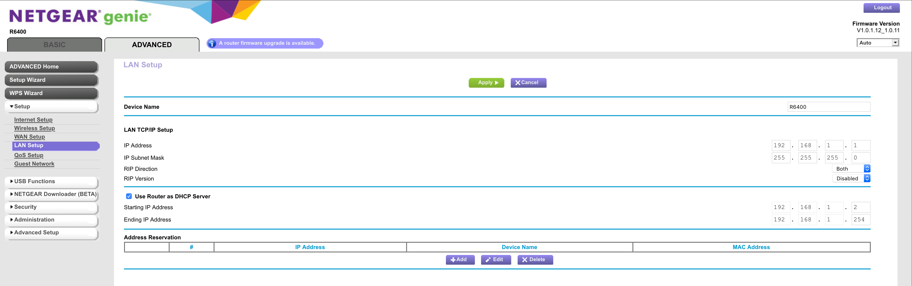
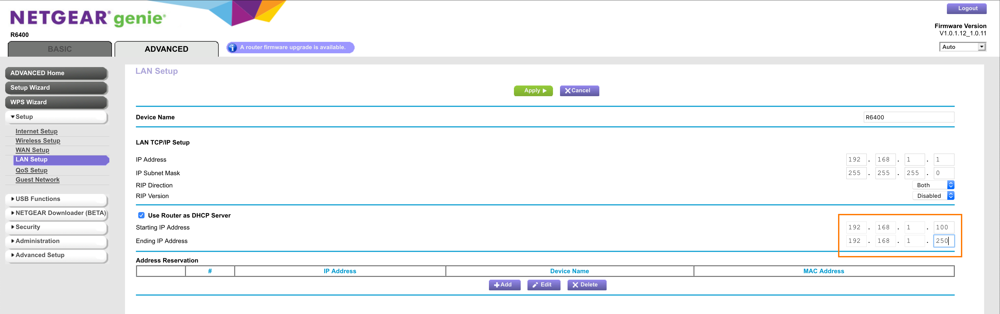
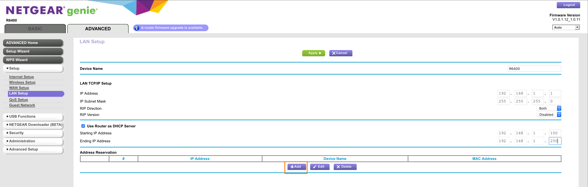
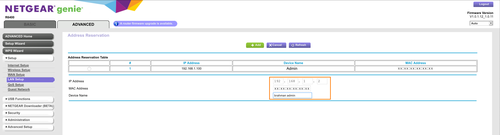
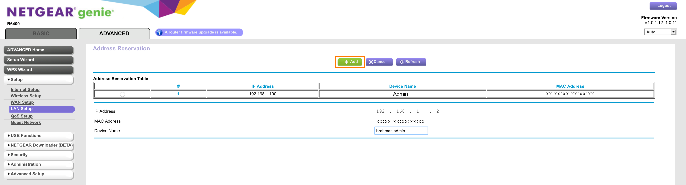
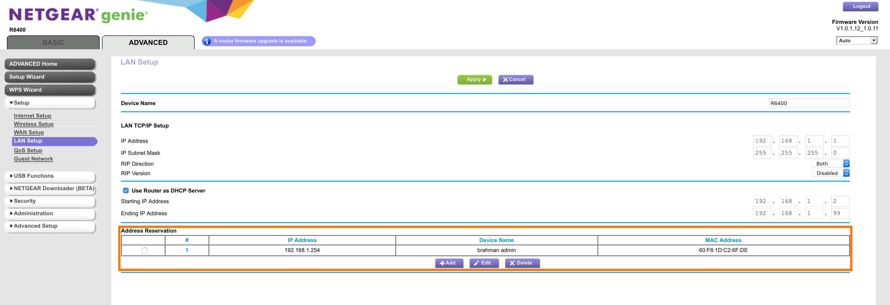

# Setting Up A Raspberry With Anisble

A guide to using Ansible to setup and configure an arbitrary number of rapsberry pis (RPis) on a wifi network.

### Assumptions:

* Some comfort with terminal, general understanding of unix/linux.
* Written from the POV of a Mac OSX user. (Sorry WinBros)

### Requirements:

* **Admin Access to your Router**
* RaspberryPi with some sort of networking capacity (ethernet and/or wifi)
	* MicroSD Card and Adapter
	* Power

### Tools:

* BalenaEther
* Homebrew
* Ansible

### Outline:

1. Let's Get the Gear (Preparation)
1. Making a RaspberryPi from scratch (you must first invent the universe.)
	1. Flash
	1. Contact
1. Grab the MAC Address
1. Configure your router


## Go Get the Gear!

1. Homebrew if you got it ([get it if you don't](https://brew.sh/))
2. run `brew cask install balenaetcher`
3. download the [latest Raspbian Image](https://www.raspberrypi.org/downloads/raspbian/)

## Flashing

1. launch BalenaEtcher (from the terminal) `open /Applications/balenaEtcher.app/`
1. Flash MicroSD with Raspbian (remove and reinsert MicroSD)
1. open terminal
1. change working directory to the MicroSD card with `cd /Volume/boot`
1. create a blank file named 'ssh' `> ssh`
1. create the configuration to connect to your wifi network `nano wpa_supplicant.conf`

enter this:

```
country=US
ctrl_interface=DIR=/var/run/wpa_supplicant GROUP=netdev
update_config=1

network={
	ssid="your-wifi-network"
	psk="s00p3r_53cr37"
	key_mgmt=WPA-PSK
	scan_ssid=1
}
```

* press `control+x`, then `y`, then `enter` to save and exit
* eject and remove MicroSD
* With the RPi **UNPLUGGED**
* Insert MicroSD and connect power/turn on

## Making Contact

We're going to attempt to make contact to our RPi. Assuming everything went well, the RPi should have automatically connected to the network we configured in the previous step using the credentials in the `wpa_supplicant.conf` file.

* run `ping raspberrypi.local`
* try a few times until you get a response that looks like:

```
$ ping raspberrypi.local
PING raspberrypi.local (169.254.125.107): 56 data bytes
Request timeout for icmp_seq 0
64 bytes from 169.254.125.107: icmp_seq=1 ttl=64 time=0.380 ms
64 bytes from 169.254.125.107: icmp_seq=2 ttl=64 time=0.233 ms
```

If after a minute or two, it doesn't work:

* Connect to the RPi via ethernet (use thunderbolt or USB to ethernet adapter)
* Ping as above

If you can't make contact via ethernet (Pi Zero):

* power off the RPi
* remove the MicroSD
* insert MicroSD into your computer
* using the CLI, change your working directory to `/Volumes/boot`
* run `nano wpa_supplicant.conf`
* copy the text from the previous seciont and double check you SSID and PSK. They must be 100% correct (case sensitive and all that)

You can also check your router to see if your RPi shows up as a connected or recently connected device.

## Grab the MAC Address

Once you make contact with your RPi, we can run a command over `ssh` to get the MAC address its wifi adapter, the `wlan0` device.

* run `ssh pi@raspberrypi.local 'ip wlan0'`
* copy paste the MAC address into a list
* Repeat this for all the RPis you wish to setup on your network

## Router Configuration

By default, all RPis have the hostname set to `raspberrypi`. If more than one device advertises the same hostname to a router, it's possible that the router will locally assign a hostname to the duplicate device. This is a bit unpredictable and can lead to confusion over which device you're actually connecting to.

The list of MAC addresses generated from the process above is necessary to configure the router so that static IP addresses are reserved for each RPi.

### Outline of steps:

1. Log into your router and locate the LAN settings
1. Modify the IP range used by DHCP
1. Reserve an IP for your device(s)

### Locate LAN Settings

The following images show the setup on a Netgear R6400 router. Your router (and mileage) may vary.

<br>
LAN Settings Panel

### Modify IP Range used by DHCP

You can setup the IP range used by DHCP to automatically (and unpredictably) assign IP addresses to clients here. Conversely, we are blocking out a range that we will use for IP addresses that will be reserved for RPis or other devices.

* Set the **Starting IP Address** and **Ending IP Address** to be used by DHCP for dynamic IP address assignment.
* Apply the settings

<br>
Editing the IP range used by DHCP for automatic IP address assignment

**Note:** If we wish to reserve the range from 192.168.1.100-254, we'd set the starting IP to 192.168.1.2 and the ending IP to 192.168.1.99. This tells DHCP to only use 192.168.1.2-99 for dynamic IP assignment.


### Reserving IP Addresses

* Add a reserved IP address using its MAC address

<br>
Adding a device

**Note:** Spoofing your MAC address will break this assignment

* Enter the desired IP address
* Enter the device MAC Address

<br>
Reserving IP address

* Add the device

<br>
Adding the device

### IP Reserved!

In order to test that the reservation was successful, connect your device to the network and ping/ssh into it.

<br>
Reserved IP address

## Working with Ansible

> Ansible is an open-source software provisioning, configuration management, and application-deployment tool. It runs on many Unix-like systems, and can configure both Unix-like systems as well as Microsoft Windows. It includes its own declarative language to describe system configuration. — [Source: Wikipedia](Ansible is an open-source software provisioning, configuration management, and application-deployment tool. It runs on many Unix-like systems, and can configure both Unix-like systems as well as Microsoft Windows. It includes its own declarative language to describe system configuration.)

### Overview

1. Installing Ansible (version 2.9  at time of writing)
1. Setting up your Inventory
1. Running Individual Modules
1. Working with Playbooks

### Installation:

[Full Installation Documentation](https://docs.ansible.com/ansible/latest/installation_guide/intro_installation.html)

#### Mac OSX

* Option 1 - Install with [Homebrew](https://brew.sh): `brew install ansible`
* Option 2 - Install using `pip` (ansible recommended): `pip install --user ansible`

#### Debian Linux

* Add the following line to `/etc/apt/sources.list`:

```
deb http://ppa.launchpad.net/ansible/ansible/ubuntu trusty main
```

* Then run these commands:
	1. `$ sudo apt-key adv --keyserver keyserver.ubuntu.com --recv-keys 93C4A3FD7BB9C367`
	1. `$ sudo apt update`
	1. `$ sudo apt install ansible`

### Setting up your Inventory

Your inventory defines your collection of devices. We're not going to go into the details here, but it's possible to group your hosts in a number of ways depending on the complexity of your system. For now, we'll create a single group for our RPis.

#### File Structure

* Create a directory structure for your ansible files in your project by running the following commands:
	* `cd /the/path/to/your/project`
	*  `mkdir ansible; cd ansible`
	*  `mkdir inventory roles files template group_vars host_vars`
	*  `cd inventory`
	*  `>all`

From your project folder your should have a directory structure something like this:

```
.
└── anisble
    ├── files
    ├── group_vars
    ├── host_vars
    ├── inventory
    │   └── all
    ├── roles
    └── templates
```

#### Building the Inventory

We'll focus on the inventory, which is configured in the `all` file we just created.

Have a look at the following example file:

```
# Group
[raspberry_pis]

# hostname	ip address
brahman_vision_000	ansible_host=192.168.1.100
brahman_vision_001	ansible_host=192.168.1.101
brahman_vision_002	ansible_host=192.168.1.102
brahman_vision_003	ansible_host=192.168.1.103
brahman_vision_004	ansible_host=192.168.1.104
brahman_vision_005	ansible_host=192.168.1.105

```

You can generate a list for a range of devices using the script below:

```
#!/bin/bash

FILENAME="all"
GROUP_NAME="raspberry_pis"
BASE_NAME="brahman_vision"
IP_SUBNET="192.168.1"
START=0
END=99

# create a list
> $FILENAME

# add group name
echo -e "[$GROUP_NAME]\n" >> $FILENAME

# generate the list
for (( i=$START; i<=$END; i++ )); do
        HOST_NUMBER=$(printf "%0*d\n" 3 $i)
        HOST_IP=$(( $i + 100 ))
        echo "${BASE_NAME}_${HOST_NUMBER} ansible_host=${IP_SUBNET}.${HOST_IP}" >> $FILENAME
done

exit $?

```

* run the script from the `guides` directory: `bash genHostList.sh`
* move the output into the inventory directory: `mv all anisble/inventory/`

Your inventory should be set.

#### Working with Group Variables

You can set group variable values for ansible to work with in a couple of different place. For the sake of keeping the file content minimal, we'll create and edit a file containing group variables in the `ansible/group_vars` folder in `.yml` format.	

* create a file for group variables `nano ansible/group_vars/raspbery_pis`
* add the following to the file:

```
---
# file: group_vars/raspberry_pis
ansible_user=pi
```

**Note:** Though we could have put this information in the `all` file in our inventory, it'll be a lot easier to find this information here when we ned to change this in the future. For instance, when we want to change the username or remove the default username, we can update the variable here to match.