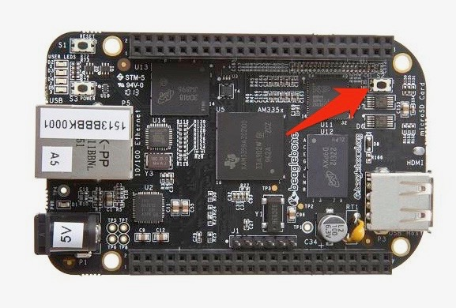

# Beaglebone Black Headaches...

1. Boot from SDCard
2. Mount eMMC partition to edit uEnv.txt file
3. Expanding the file partition


## Booting from the MicroSD Card (...once)

I like Debian. This is for booting into a Debian image. Using these instructions on other distributions? Safety not guaranteed.

1. Download an image from [here](https://elinux.org/Beagleboard:BeagleBoneBlack_Debian#Debian_Releases)
2. Expand the file to obtain the `.img` file
3. Flash to a MicroSD using [balenaEtcher](https://www.balena.io/etcher/) or `dd` or your favorite image writer.
4. Disconnect Beaglebone from power.
5. Insert MicroSD Card.
6. Locate, press and hold the "user boot" button until the first two blue user lights come on and then release.



* You should now be able to ssh into the Beaglebone Black using `ssh debian@<beagle_bone_ip>` with `debian:temppwd`

## Towards booting from MicroSD, ALWAYS

The above steps will get you into the MicroSD OS. But likely because the eMMC only has 4GB of space, you'll want to always use the MicroSD card. Here's my attempt to get this working.

1. Follow the steps above.
2. run `sudo su` and enter the password (default unless you've changed it) to switch to root user
2. run `mount /dev/mmcblk1p1 /media/` to mount the eMMC file system at /media/
3. `cd /media/;ls -l` should yield:

```
drwxr-xr-x  2 root root  4096 Feb  4 06:19 bin
drwxr-xr-x  4 root root  4096 Feb  4 06:11 boot
drwxr-xr-x  2 root root  4096 Jan  1  2000 dev
drwxr-xr-x 96 root root  4096 Feb  5 19:24 etc
drwxr-xr-x  5 root root  4096 Feb  5 19:26 home
-rw-r--r--  1 root root    40 Jan 24  2016 ID.txt
drwxr-xr-x 17 root root  4096 Feb  4 06:09 lib
drwx------  2 root root 16384 Jan  1  2000 lost+found
drwxr-xr-x  2 root root  4096 Jan 24  2016 media
drwxr-xr-x  2 root root  4096 Jan 24  2016 mnt
-rw-r--r--  1 root root  1008 Jan 24  2016 nfs-uEnv.txt
drwxr-xr-x  7 root root  4096 Jan 24  2016 opt
dr-xr-xr-x  2 root root  4096 Jan  1  1970 proc
drwx------  5 root root  4096 Jan 24  2016 root
drwxr-xr-x  2 root root  4096 Jan  1  2000 run
drwxr-xr-x  2 root root  4096 Feb  4 06:19 sbin
drwxr-xr-x  2 root root  4096 Jan 24  2016 srv
dr-xr-xr-x  2 root root  4096 Jan  1  2000 sys
drwxrwxrwt  9 root root  4096 Feb  7 19:03 tmp
drwxr-xr-x 10 root root  4096 Jan 24  2016 usr
drwxr-xr-x 12 root root  4096 Jan 24  2016 var
```
4. run `cp /bbb-uEnv.txt /media/uEnv.txt`copy the bbb-uEnv.txt from out current filesystem into the eMMC filesystem as uEnv.txt. Theoretically, this should tell uboot to switch to the MicroSD partition when it tries to boot from the eMMC (don't know if this breaks things when MicroSD is removed!)
5. run `sync` to cache to disk
6. run `shutdown -r now` to reboot

* When you login in over ssh, it should be into the MicroSD card OS.

## Expanding the Filesystem

If you've completed the above steps and are confident that you've booted into the OS flashed to your MicroSD card, you'll notice that your partition doesn't span full size of your card.

runing `df -h` yields:

```
~$ df -h
Filesystem      Size  Used Avail Use% Mounted on
udev            216M     0  216M   0% /dev
tmpfs            49M  5.4M   44M  12% /run
/dev/mmcblk0p1  3.4G  2.2G  1.1G  67% /
tmpfs           243M     0  243M   0% /dev/shm
tmpfs           5.0M  4.0K  5.0M   1% /run/lock
tmpfs           243M     0  243M   0% /sys/fs/cgroup
tmpfs            49M     0   49M   0% /run/user/1001
```

I'm using a 16GB card and only 3.4G is allocated to /dev/mmcblk0p1 file system. Let's fix it!

1. `sudo su`
2.	`fdisk -u /dev/mmcblk0`
3. enter `p` to list the partition table

```
Disk /dev/mmcblk0: 14.9 GiB, 15931539456 bytes, 31116288 sectors
Units: sectors of 1 * 512 = 512 bytes
Sector size (logical/physical): 512 bytes / 512 bytes
I/O size (minimum/optimal): 512 bytes / 512 bytes
Disklabel type: dos
Disk identifier: 0xbecca426

Device         Boot Start     End Sectors  Size Id Type
/dev/mmcblk0p1 *     8192 7372799 7364608  3.5G 83 Linux
```

4. enter `d` to delete the partition
5. enter `n` to create a new partition
6. enter `p` for primary
7. enter `1` to set the partition number
8. enter `8192` to match the start of the old partition
9. press enter again to set the end to span the disk
10. If you receive a warning about ext4 partition signatures, enter `Y`
11. enter `w` to write the changes

```
The partition table has been altered.
Calling ioctl() to re-read partition table.
Re-reading the partition table failed.: Device or resource busy

The kernel still uses the old table. The new table will be used at the next reboot or after you run partprobe(8) or kpartx(8).
```

* at this point, fdisk should exit

1. run `partx /dev/mmcblk0`
2. `sync`
3. `shutdown -r now`
4. ssh back into the device and run sudo `resize2fs /dev/mmcblk0p1`
5. `df -h` to confirm

```
Filesystem      Size  Used Avail Use% Mounted on
udev            216M     0  216M   0% /dev
tmpfs            49M  4.8M   44M  10% /run
/dev/mmcblk0p1   15G  2.2G   12G  16% /
tmpfs           243M     0  243M   0% /dev/shm
tmpfs           5.0M  4.0K  5.0M   1% /run/lock
tmpfs           243M     0  243M   0% /sys/fs/cgroup
tmpfs            49M     0   49M   0% /run/user/1001
```

# GREAT SUCCESS!