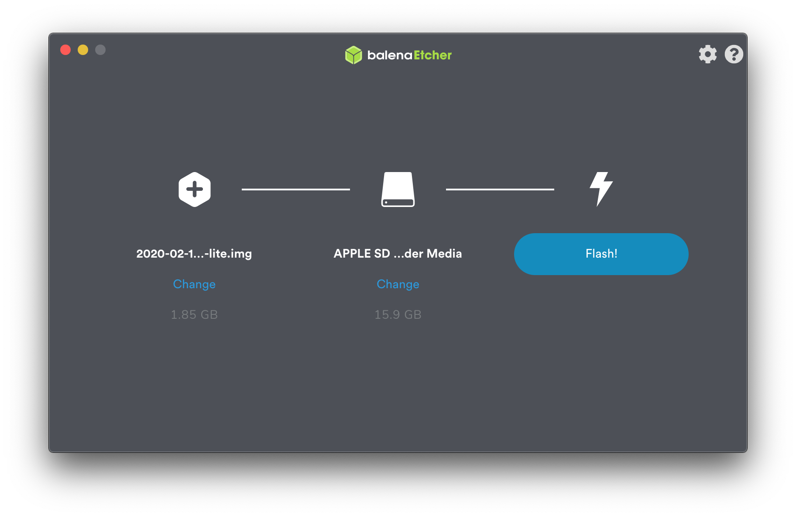

# Setting up a Raspberry Pi (OSX)

This guide walks through the steps to setup a Raspberry Pi using a Mac OSX machine. This guide assumes familiarity and comfort with the OSX terminal or command line interface (CLI).

### Overview

* Gathering the tools
* Downloading the images
* Burning the image
* Setting up SSH
* Setting up Wifi
* Booting for the first time

## Tools

These tools are the ones I typically use when setting up a Raspberry Pi for the first time.

* Terminal - OSX's built in terminal
* Homebrew - Install and maintain packages from the command line with ease
* BalenaEtcher - Used to burn disc images to flash media
* Wireshark - A power packet sniffing tool used to locate a Pi on a network.

### `terminal.app`

Most steps involved in this walkthrough require the use of a command line interface.

* using spotlight, search for terminal:


* launch the app and proceed

### [Homebrew](https://brew.sh)

>The Missing Package Manager for macOS

source -- [https://brew.sh](https://brew.sh)

We'll use this to install the tools we need. If you don't already have this installed, it's vital. Do it.

* Install via the command line:

```
$ /bin/bash -c "$(curl -fsSL https://raw.githubusercontent.com/Homebrew/install/master/install.sh)"
```

### [BalenaEtcher](https://www.balena.io/etcher/)

>Flash OS images to SD cards & USB drives, safely and easily.

source -- [https://www.balena.io/etcher/](https://www.balena.io/etcher/)

Used to burn the Raspbian image to an SD card.

* Install using homebrew: `$ brew cask install balenaetcher`

### [Wireshark](https://www.wireshark.org)

>Wireshark is the world’s foremost and widely-used network protocol analyzer.

source -- [https://www.wireshark.org](https://www.wireshark.org)

Used to find the PI over ethernet

* Install using homebrew: `$ brew cask install wireshark`

### [nmap](https://nmap.org/)

>Nmap ("Network Mapper") is a free and open source (license) utility for network discovery and security auditing.

source -- [https://nmap.org/](https://nmap.org/)

In extreme circumstances, we can use this tool to find our Pi. `nmap` is an advanced network scanning tool.

## Raspbian

* I like Raspbian. I rarely use the desktop (headless 4eva!). Whichever works best for you, get it. Where? [https://www.raspberrypi.org/downloads/raspbian/](https://www.raspberrypi.org/downloads/raspbian/)

* Once downloaded, use BalenaEtcher to burn the image to an sd card.



## Setting up `ssh` and wifi connectivity.

If you are running headless, you don't need a monitor. Cool yeah? Instead, you'll need to remote into your machine using a secure shell, `ssh`.

* remove the flashed card and reinsert it.
* on OSX, it should appear at /Volumes/boot. Run `$ ls /Volumes/boot` to confirm.
* create a file named "ssh" in /Volumes/boot: `$ >/Volumes/boot/ssh`

You can connect directly to the pi via ethernet and log in. We'll cover those steps later. If you want to do this over WiFi, first you must create a `wpa_supplicant.conf` file in `/Volumes/boot`:

* `nano /Volumes/boot/wpa_supplicant.conf`
* enter the following text:


```
country=US
ctrl_interface=DIR=/var/run/wpa_supplicant GROUP=netdev
update_config=1

network={
	ssid="your-wifi-network"
	psk="s00p3r_53cr37"
	key_mgmt=WPA-PSK
	scan_ssid=1
}
```

* Press `control+x`, then `y`, then `enter` to save and exit
* Eject and remove MicroSD
* With the Pi **UNPLUGGED**
* Eject the card
* Insert it into the Pi
* **DO NOT TURN IT ON YET**
* (optional but *recommended*) Connect to the Pi via ethernet port using thunderbolt or USB to ethernet adapter.
* **now you may turn it on**

## Where my PI at?

This can be the most frustrating part of setting up a Raspberry Pi without a monitor and keyboard. If you've made an ethernet connection between your computer and the Pi, this should be a snap.

Over a WiFi network, things can get complicated, especially in places where there may be multiple raspberry pis on the network, but it still might work.

That said, here are three ways to get the IP address of your Pi. Your milage may vary based on the circumstances described above. 

### Using `ping` (easy)

* in the terminal type `ping raspberrypi.local`
* try a few times until you get a response that looks like:

```
$ ping raspberrypi.local
PING raspberrypi.local (169.254.125.107): 56 data bytes
Request timeout for icmp_seq 0
64 bytes from 169.254.125.107: icmp_seq=1 ttl=64 time=0.380 ms
64 bytes from 169.254.125.107: icmp_seq=2 ttl=64 time=0.233 ms
```

### Using `wireshark` (advanced)

* fire up wireshark from the terminal: `$ wireshark`
* select your ethernet interface:


* turn on your pi and collect some packets
* keep your eye out for `raspberrypi.local`:


* now we have the IP address

### Using `nmap` (1337)

If you're unable to find your PI using the above methods, then you have to break out the big guns and do a network scan. Depending on your network, this may or may not alert your local network admins to suspicious activity. Unwanted network scans are considered intrusive.

* find the ip address of your router: `$ route get default | grep gateway`

```
$ route get default | grep gateway
	gateway: 10.0.0.1
```

* scan the network for devices: `$ sudo nmap -sn 10.0.0.0/24`

```
 sudo nmap -sn 10.79.10.0/24
Starting Nmap 7.70 ( https://nmap.org ) at 2020-04-10 12:54 EDT
Nmap scan report for 10.0.0.1
Host is up (0.0068s latency).
MAC Address: F8:E9:03:DA:BF:D4 (D-Link International)
Nmap scan report for 10.0.0.126
Host is up (0.070s latency).
MAC Address: B8:27:EB:XX:XX:XX (Raspberry Pi Foundation)
Nmap scan report for 10.0.0.246
Host is up.
Nmap done: 256 IP addresses (19 hosts up) scanned in 24.84 seconds
```

* The possible IP of the PI is `10.0.0.126`, based on the manufacturer associated with the MAC address OUI block accourding to `nmap`. If there are multiple devices, you could create a list of ip addresses to try to login to. Be aware that some devices may have default credentials set. This is why it's always best to do this over ethernet or on an isolated private network.

## `ssh` into the RPi

Using either the local hostname or the IP address, we can attempt to access the Pi from the terminal over `ssh`:

* Use local hostname to connect:
	* in the terminal type `ssh pi@raspberrypi.local`

Sometimes there are multiple raspberry pis on your network (especially in a shared learning space).

* Use the IP address:
	* enter `$ ssh pi@<your_pi's_ip_address>` for example.


* you'll be asked if you want to add the RPi to a list of "known hosts", type `y` and press `enter`
* enter the default password, `raspberry`

You should see something like this:

```
The programs included with the Debian GNU/Linux system are free software;
the exact distribution terms for each program are described in the
individual files in /usr/share/doc/*/copyright.

Debian GNU/Linux comes with ABSOLUTELY NO WARRANTY, to the extent
permitted by applicable law.

SSH is enabled and the default password for the 'pi' user has not been changed.
This is a security risk - please login as the 'pi' user and type 'passwd' to set a new password.

pi@raspberrypi:~ $
```

## Change the Password

* run `passwd` and follow the prompts

## Change the Hostname

* add your new hostname to `/etc/hostname` using `sudo echo "new_hostname" > /etc/hostname`
* add the hostname to `/etc/hosts`, replace "raspberrypi" which follows 127.0.1.1 with your "new_hostname"
* reboot `sudo reboot`

You can connect to your RPi using `ssh pi@new_hostname.local`