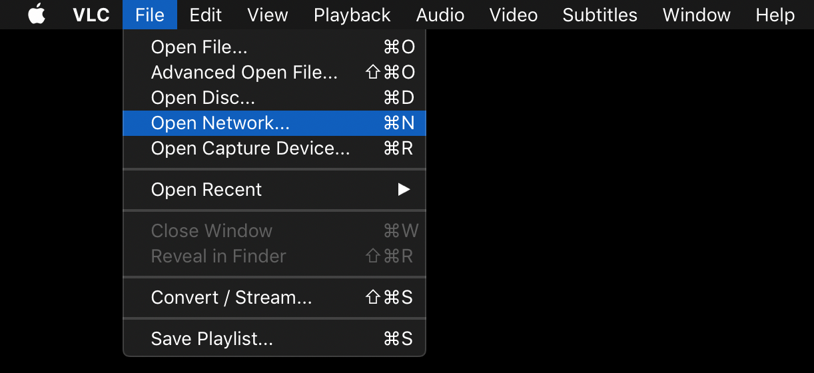
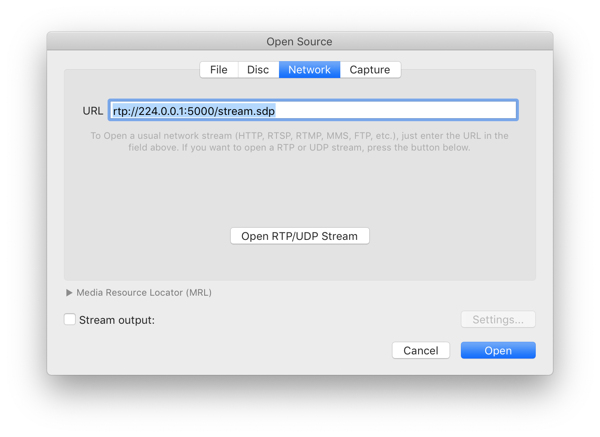
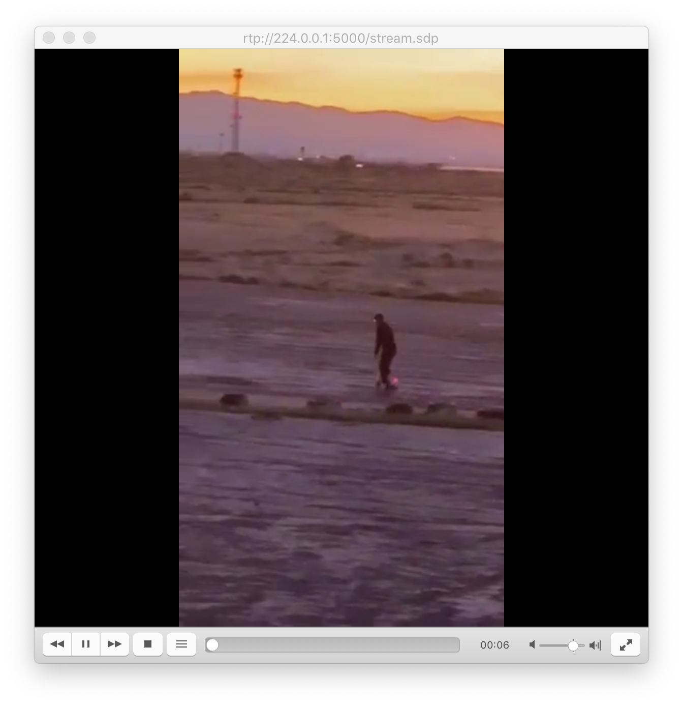

# Streaming FFMpeg > VLC (for OSX)

0. Requirements
1. Setup Stream
2. Catch with VLC

I learned it [here](https://trac.ffmpeg.org/wiki/StreamingGuide).

## Get the gear!

If you don't already have it installed, I recommend using [homebrew](https://brew.sh)

Once installed, run `brew install ffmpeg; brew cask install vlc`.

## Setup Stream using `ffmpeg`

Example of a successful stream:

```
ffmpeg -re -stream_loop -1 -i "/Users/phillipstearns/IMG_2428.mp4" -vcodec h264 -acodec aac -f rtp_mpegts "rtp://224.0.0.1:5000/stream.sdp"
```

* `-re` specifies native playback rate
* `-stream_loop -1` loops forever
* `-i` specifies the input file (use full path!)
* `-vcodec` specifies the video codec to stream (`ffmpeg -codecs` to list)
* `-acoded` specifies the audio codec to stream (`ffmpeg -codecs` to list)
* `-f` specifies the output format (`ffmpeg -formats` to list)
* `rtp://224.0.0.1:5000/stream.sdp` establishes an RTP stream using UDP. the .sdp is necessary for the client media player to understand how to decode the stream.

## Catching stream with VLC

<br>
`command+n` to open a new network source

<br>
enter `rtp://224.0.0.1:5000/stream.sdp` and click the "open" button

<br>
sit back and enjoy the stream!