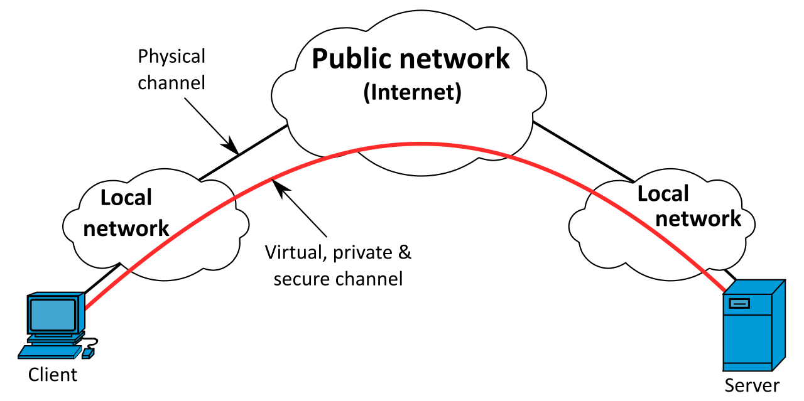

# VPN using wireguard (OSX and Linux[Raspbian, Debian])

### VPN - Virtual Private Network

> A virtual private network (VPN) extends a private network across a public network, and enables users to send and receive data across shared or public networks as if their computing devices were directly connected to the private network. Applications running on a computing device, e.g., a laptop, desktop, smartphone, across a VPN may therefore benefit from the functionality, security, and management of the private network. Encryption is a common, though not an inherent, part of a VPN connection.

### Tunneling

> a tunneling protocol is a communications protocol that allows for the movement of data from one network to another. It involves allowing private network communications to be sent across a public network (such as the Internet) through a process called encapsulation.

### Encapsulation

> encapsulation is a method of designing modular communication protocols in which logically separate functions in the network are abstracted from their underlying structures by inclusion or information hiding within higher level objects.

### Types of VPNs and Protocols

[Types and Protocols](https://www.vpnoneclick.com/types-of-vpn-and-types-of-vpn-protocols/)

## [Wireguard](https://www.wireguard.com/)

* [Documentation (Unofficial)](https://github.com/pirate/wireguard-docs)

> WireGuard® is an extremely simple yet fast and modern VPN that utilizes state-of-the-art cryptography.

* A VPN is a point-to-point connection between two devices over a public network.
* Wireguard uses a Server/Client model.
* Simple public/private key authentication and encryption

### Uses

* Create a secure way of accessing remote devices and services
* Mask your IP address for general browsing
	* Potentially circumvent geolocation restrictions

## Installation on OSX

`brew install wireguard-tools`

## Installation on Raspbian

* https://github.com/adrianmihalko/raspberrypiwireguard
*  

## Installation on Beaglebone

## Installation on Debian

`apt install wireguard`

## Setup Public/Private Keys

## Setup Server and Client

* Devices are call Peers.
* Peers can operate as either a server or a client, depending on configuration

### Server Setup

