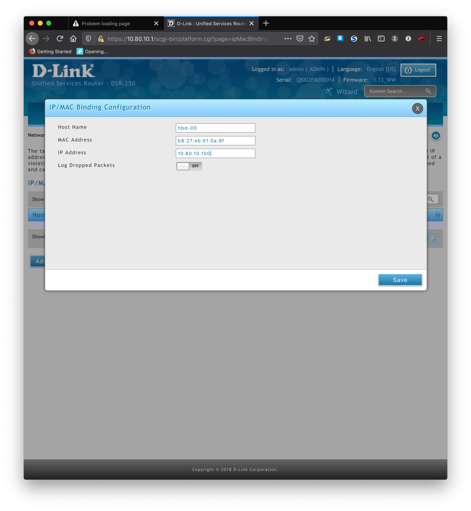

# Cluster configuration

## Router Setup

* Using a Dlink DIR-250 Unified Service Router to connect to the BRAHMAN-AI LAN @ 10.79.10.30
* It's internal IP space is 10.80.10.0/24
* DHCP is enabled and using 10.80.10.2-99
* Currently it's possible to access the internal IP ranges from the LAN, but this will be changed for security reasons later
* IP/MAC binding used to set RPis on predictable IP addresses
* All the RPis have been preconfigured with unique hostnames, so this is a bit different than starting from scratch.
* Use a `bash` one-liner to grab hostnames and MAC addresses for the **ethernet interface**:

```
for i in {0..7}; do ssh hbd-0$i.local 'echo -n "$HOSTNAME: "; ip addr show eth0 | grep ether';done
hbd-00:     link/ether b8:27:eb:51:0a:9f brd ff:ff:ff:ff:ff:ff
hbd-01:     link/ether b8:27:eb:ff:fe:bb brd ff:ff:ff:ff:ff:ff
hbd-02:     link/ether b8:27:eb:f4:cc:9e brd ff:ff:ff:ff:ff:ff
hbd-03:     link/ether b8:27:eb:11:8d:94 brd ff:ff:ff:ff:ff:ff
hbd-04:     link/ether b8:27:eb:67:6a:43 brd ff:ff:ff:ff:ff:ff
hbd-05:     link/ether b8:27:eb:a0:23:fa brd ff:ff:ff:ff:ff:ff
hbd-06:     link/ether b8:27:eb:75:79:c2 brd ff:ff:ff:ff:ff:ff
hbd-07:     link/ether b8:27:eb:73:d0:e6 brd ff:ff:ff:ff:ff:ff
```
* There might be an automated way of doing this by connecting to the router over ssh...



Actually this isn't working right yet...