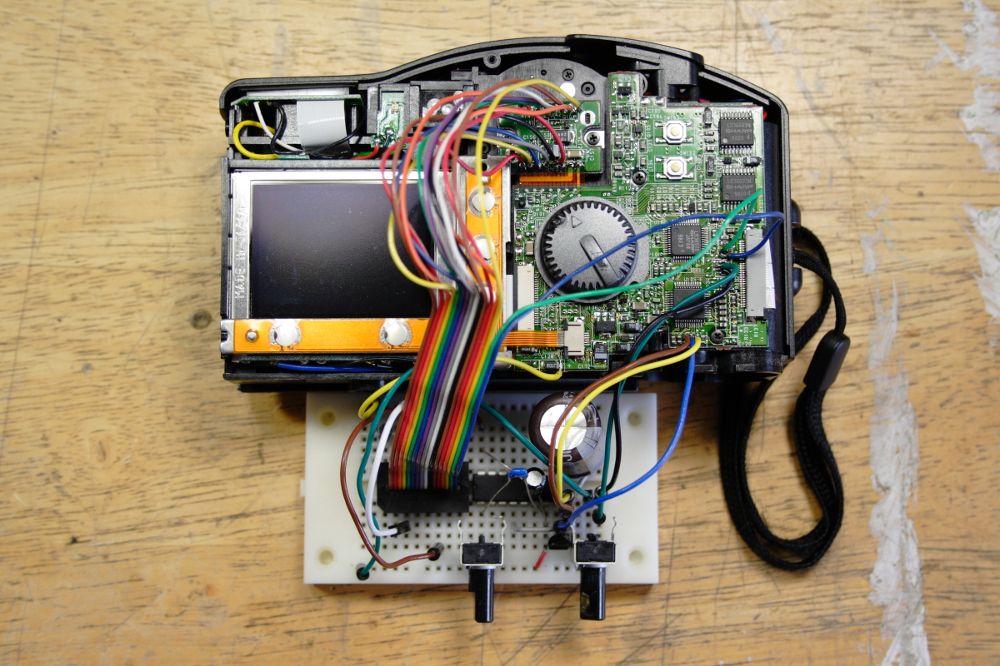

# Hello!

### I'm Phillip David Stearns

 
But you can call me Phil.

## An Icebreaker

* My Credentials
* Things I've done
* What I'd like to do @ BRAHMAN
* Skills I'd love to share

## Street Cred

* Studied Engineering Physics
* BS Music - Audio Engineering
* MFA CalArts - Music / Integrated Media
* Residencies
	* STEIM
	* Harvestworks
	* The WaveFarm (formerly Free103Point9)
	* Experimental TV Center & Signal Culture
	* Sporobole
* Awards
	* NYSCA Individual Artist Grant
* Teaching
	* Parsons New School - Physical Computing
	* NYU - Creative Coding
	* New York Institue of Technology
	* SFPC
	* NØ SCHOOL
	* Workshops all over
* Member of NEW INC

## Things I've done

### Circuit Bending

 
DCP_Series (2011)

### Experimental Photography

 
High Voltage Images (2013)

### Glitch Art

 
Forest for the Trees - Year of the Glitch (2012)

### GlitchTextiles

 
[GlitchTextiles.com](https://glitchtextiles.com) (2011)

### Textile Art

 
Fragmented Memory (2013)

### Textile Design

 
Fabric for Dior 2015 Cruise Collection (2014)

### Installations

Entity I (2010)

 
Chandelier for One of Many Possible Ends (2014)

 
Open Vault (2019)

### 3D Animation

Music Video for Kimbra's Sweet Relief (2016)

Music Video for Ruby Suns The Zipper (2018)

### Video Art

VGA Syntehsizer (2007-Present)

### Cyber Security Art

SYN-ACK (2019 performance)

### Physical Computing

New Max by Madeline Hollender (2020)

7S, 7Z, 1S, 2Z (2019)

## BRAHMA Ambitions

### Cluster Computation

### Mesh Networking

### HD Analog Video Synthesis

